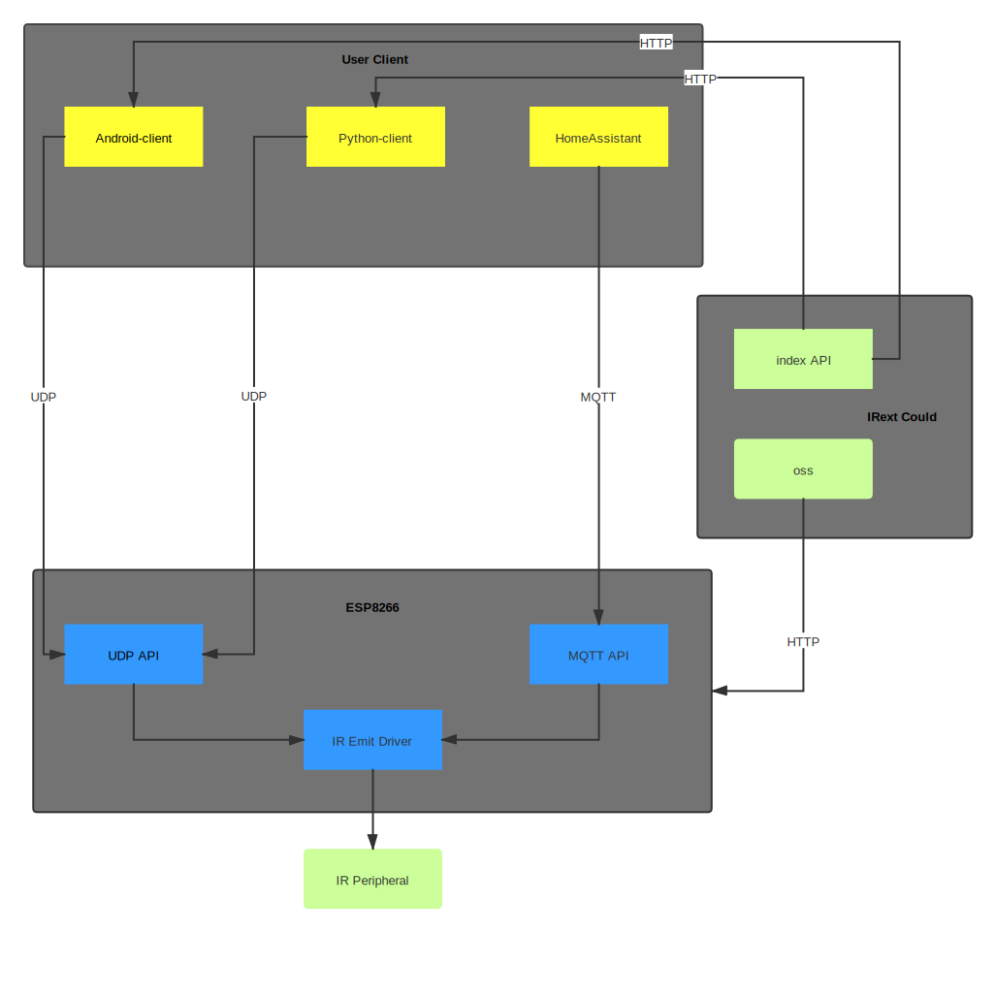
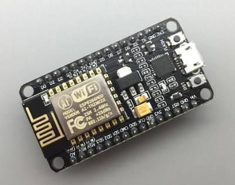
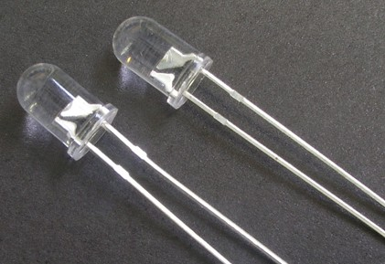
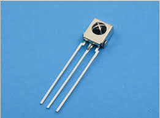

# IRbaby

IRbaby 使用 [Irext](https://github.com/irext/irext-core) 开源红外库，提供数以万计的红外设备遥控编码。
IRbaby 帮助你使用 ESP8266 系列模块，只需对其进行简单设置就可以快速在 [HomeAssisant](https://www.home-assistant.io) 里的控制红外设备。

---

## 特点

* Irext 强大红外码库
* 支持基于 ESP8266 的模块
* MQTT 支持
* 支持录码
* 离线解码
---

## 架构图

## 开始使用
> 1. **下载 ESP8266 固件并烧写到设备。[IRbaby-firmware](https://github.com/Caffreyfans/IRbaby-firmware)**
> 2. **设备上电，移动端搜索连接到 `ESP**` 信号，并在浏览器中输入 `192.168.4.1` 对设备进行联网设置**
> 3. **下载 `Android` 或 `Python` 客户端并运行,对设备进行 `MQTT` 和红外收发引脚设定。[IRbaby-android](https://github.com/Caffreyfans/IRbaby-android), [IRbaby-python](https://github.com/Caffreyfans/IRbaby-python)
> 4. 匹配电器，完成控制

> **IRbaby目前仍处于开发阶，目前的交互协议可能随时改变，不保证向后兼容，升级新版本时需要注意公告说明同时升级固件和客户端。**

## 材料
### 红外接收头可选
|||
|---|---|
| |  |
 |  |

## 关于连线

`备注：红外二级管连接的时候也可以尝试不用三级管，直接连接。红外二级管长引脚接gpio，短脚接地。红外接收头的话就照着上图标示的那样与模块连接。`

## 附加下载地址
如果你有在 **github releases** 下载文件过慢的问题，请在 [http://caffreyfans.top/IRbaby](http://caffreyfans.top/IRbaby) 下在对应文件

## 特别感谢
[Strawmanbobi](https://github.com/strawmanbobi) Irext开源库的作者，给予我技术和精神上的支持

