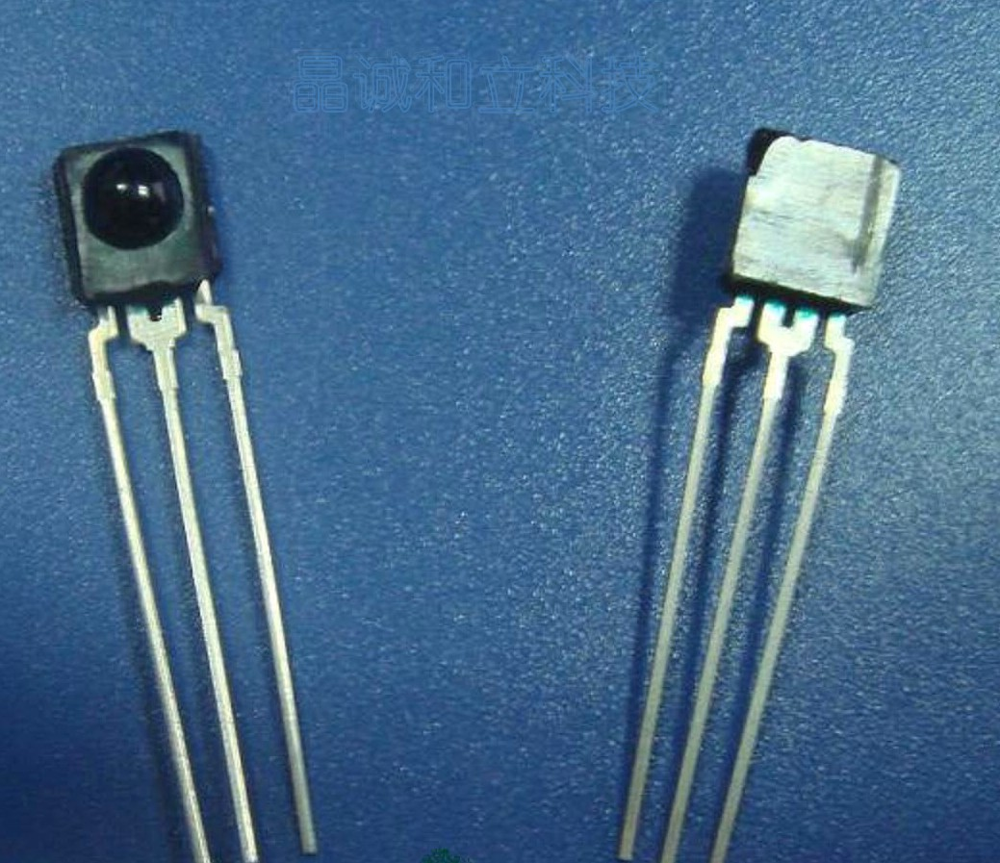

# IRmqtt Firmware

IRmqtt 使用 [Irext](https://github.com/irext/irext-core) 开源红外库，IRext 提供数以万计的红外设备遥控编码。
IRmqtt 帮助你使用 ESP8266 系列模块，只需对其进行简单设置就可以快速在 [HomeAssisant](https://www.home-assistant.io) 里的控制红外设备。

---

## 特点

* *Irext* 强大开源红外码库
* 支持大多数基于 ESP8266 的板子
* *MQTT* 支持
* 支持录码

## 版本信息
---
> **2019-05-06** 
> v2.1 修复无法获取设备问题，先直接运行 IRmqtt-tool.exe 不再依赖 python3 环境

---
> **2019-05-04** 
> v2.0 增加录码功能  

---
> **2018-08-04** 
> v1.0 只支持空调设备  

---
> **IRmqtt目前仍处于开发阶，目前的交互协议可能随时改变，不保证向后兼容，升级新版本时需要注意公告说明同时升级固件和客户端。**

## 材料
### 红外接收头可选
|||
|---|---|
| |  |
 |  |

## 使用方法

1. 到 **releases** 页面下载最新文件
2. 利用 **FlashESP8266.exe** 刷写 **IRmqtt.bin** 到你的 **ESP8266** 模块
3. 通过任意移动端（笔记本、平板、手机）连接 **ESP** 开头的 **SSID**，然后浏览器进入 **192.168.4.1** 给模块配置网络
<!--4. 利用 **python3** 环境执行 **IRmqtt-tool.py** 给你的模块进行设置-->

## 关于连线

备注：红外二级管连接的时候也可以尝试不用三级管，直接连接。红外二级管长引脚接gpio，短脚接地。红外接收头的话就照着上图标示的那样与模块连接。

## 建议观看演示视频
[视频地址](https://www.bilibili.com/video/av51492029/)

## 特别感谢
[Strawmanbobi](https://github.com/strawmanbobi) Irext开源库的作者，给予我技术和精神上的支持
